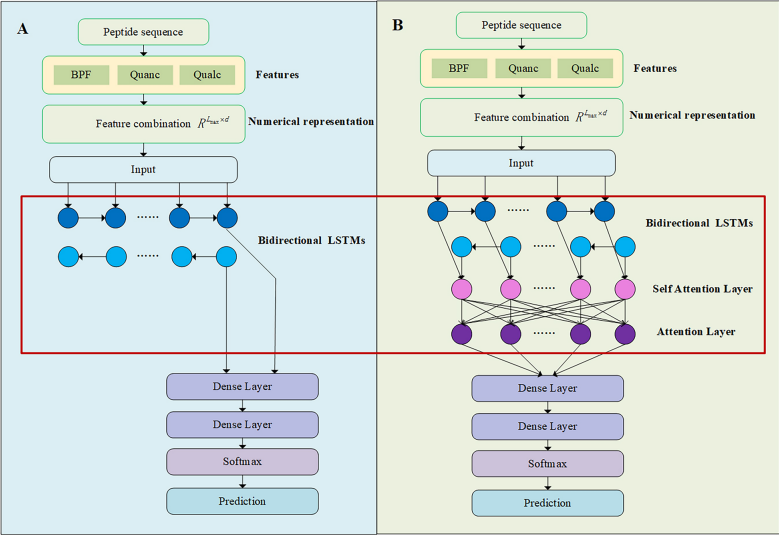

# ACPred-BMF-Manual

[](https://github.com/RUC-MIALAB/PSAIA/releases)

[](https://psaia.readthedocs.io/en/latest/?badge=latest)

# Table of contents

- [Introduction](#introduction)
- [Detailed Document](#detailed-document)
- [Web Server](#web-server)
- [License and credits](#license-and-credits)
- [Data](#data)
- [Necessary Program](#necessary-program)
- [Run](#run)
- [Contact](#contact)


## Introduction

**ACPred-BMF: bidirectional LSTM with multiple feature representations for explainable anticancer peptide prediction**, Bingqing Han, Nan Zhao, Chengshi Zeng, Xinqi Gong. [Paper](https://www.nature.com/articles/s41598-022-24404-1)



**Abstract:** Cancer has become a major factor threatening human life and health. Under the circumstance that traditional treatment methods such as chemotherapy and radiotherapy are not highly specific and often cause severe side effects and toxicity, new treatment methods are urgently needed. Anticancer peptide drugs have low toxicity, stronger efficacy and specificity, and have emerged as a new type of cancer treatment drugs. However, experimental identification of anticancer peptides is time-consuming and expensive, and difficult to perform in a high-throughput manner. Computational identification of anticancer peptides can make up for the shortcomings of experimental identification. In this study, a deep learning-based predictor named ACPred-BMF is proposed for the prediction of anticancer peptides. This method uses the quantitative and qualitative properties of amino acids, binary profile feature to numerical representation for the peptide sequences. The Bidirectional LSTM network architecture is used in the model, and the attention mechanism is also considered. To alleviate the black-box problem of deep learning model prediction, we visualized the automatically extracted features and used the Shapley additive explanations algorithm to determine the importance of features to further understand the anticancer peptide mechanism. The results show that our method is one of the state-of-the-art anticancer peptide predictors.

## Detailed Document

To make it more convenient to use and understand the details of ACPred-BMF, we have prepared a comprehensive documentation for ACPred-BMF. [ACPred-BMF-Docs](https://acpred-bmf.readthedocs.io/en/latest/)

## Web Server

We have made an online server where you can upload data and get results through ACPred-BMF. The server's link is provided here: [ACPredBMF-MIALAB-Server](http://mialab.ruc.edu.cn/ACPredBMFServer/)

We have also leveraged [Hugging Face – The AI community building the future.](https://huggingface.co/) to establish a server that is easier to operate. The server's link is provided here: [ACPred-BMF - a Hugging Face Space by MIALAB](https://huggingface.co/spaces/MIALAB/ACPred-BMF)

## License and credits

The project ACPred-BMF is licensed under [MIT](./LICENSE).
If you use this code in any future publications, please cite the following publications for general purpose:

- Han, B., Zhao, N., Zeng, C. *et al.* ACPred-BMF: bidirectional LSTM with multiple feature representations for explainable anticancer peptide prediction. *Sci Rep* **12**, 21915 (2022). https://doi.org/10.1038/s41598-022-24404-1
- [](https://doi.org/10.1038/s41598-022-24404-1)
- In addition, please follow [the ris file](CITATIONS.ris) to cite the methods you used.

## Data

This program needs fasta file corresponding to the peptide sequences to be predicted, you can organize the fasta files and place them in the 'data/' folder.

## Necessary Program

**Recommand Dependencies：**

* Python 3.8

We have placed the required Python packages in requirements.txt. You can directly use the the command below to install them.

```
pip install -r requirements.txt
```

If you encounter any issues during the installation process, please contact us for assistance.

## Run

Put fasta files of peptides in the folder named /data/.

You can choose between the following two models to run:

**1.[Main_model]**: This model was developed on the main dataset, which used ACPs/AMPs as positive/negative samples.

```
bash main.sh main
```

**2.[Alternate_model]**: This model was developed on the alternate dataset, which used ACPs/random peptides as positive/negative samples.

```
bash main.sh alternative
```

Then, you will get the results in the folder: /result/

If you want to know how to read the result file, please refer to this [ACPred-BMF-Docs](https://psaia.readthedocs.io/en/latest/?badge=latest) .


## Contact

If you have any questions, please contact with: 13168zsl@ruc.edu.cn


